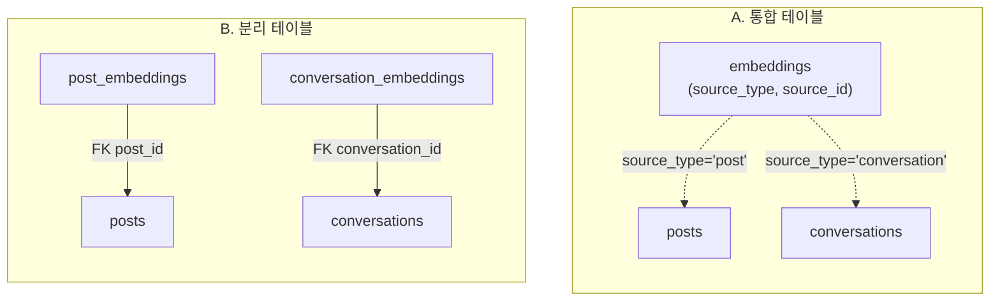

# DB 로드맵

> 지금까지 실제로 만든 테이블은 `posts`, `conversations` 두 개.
> 다음 단계인 RAG용 임베딩 저장은 아직 코드로 만들지 않았고, 설계 방향도 아직 정하지 않았다 —
> 그래서 이 문서엔 완료된 스키마와 함께, 결정이 필요한 두 가지 설계안을 나란히 붙여뒀다.
>
> 시각화 버전(다이어그램 포함): [devlog-llm DB 로드맵](https://claude.ai/code/artifact/9f4a24c1-836d-4a12-ab47-de8d60220282)

## 범례

| 상태 | 의미 |
|---|---|
| ✅ 완료 | 코드/DB에 실제로 존재 |
| 🟡 제안 · 미확정 | 설계안만 있고 아직 안 만듦 |
| ⚪ 예정 | 이 단계엔 스키마 변경 없음 |

---

## Phase 1 — `posts` ✅ 완료 (2026-08-31)

블로그 포스팅. 목록·카테고리 필터·상세·작성까지 FE+API 전부 연동 완료.

```sql
table posts (
  id          uuid        primary key default gen_random_uuid()
  title       text        not null
  content     text        not null
  category    text        not null default '일상'
  created_at  timestamptz not null default now()
)
```

컬럼별 설명은 `apps/api/schema.sql`의 `comment on column ...`으로 DB에 직접 달려 있음 (Supabase Studio
테이블 뷰·`psql \d+`에서 확인 가능).

---

## Phase 2 — `conversations` ✅ 완료 (2026-09-01)

write 페이지 AI 챗에서 나눈 대화. `context`는 대화 출처 구분용 — 지금은 `"devlog-chat"` 하나뿐이지만,
나중에 다른 수집기(예: Claude Code 세션 로그)가 붙어도 같은 테이블을 재사용할 수 있게 열어둔 필드.

```sql
table conversations (
  id          uuid        primary key default gen_random_uuid()
  session_id  text        not null
  role        text        not null   -- 'user' | 'assistant'
  content     text        not null
  context     text                   -- 'devlog-chat'
  created_at  timestamptz not null default now()
)
```

`POST /chat`이 스트리밍 시작 전 사용자 메시지, 스트리밍 종료 후 AI 응답 전체를 자동 저장.
`POST /conversations`도 독립 엔드포인트로 따로 존재. 컬럼별 설명도 `schema.sql`에 `comment on column`으로
달려 있음 (Phase 1과 동일).

---

## Phase 3 — `embeddings` 🟡 제안 · 미확정

RAG 검색용 벡터 저장소. `posts`와 `conversations` 양쪽을 다 검색 대상으로 삼아야 하는데, 두 소스를
하나의 임베딩 테이블로 묶을지 소스별로 나눌지가 아직 정해지지 않았다 (`STRATEGY.md`의 "미정 사항" —
벡터DB 항목). 데이터가 좀 더 쌓인 뒤 진행 예정이라 지금은 설계안과 임베딩 모델 후보를 비교만 해둔다.

### 임베딩 모델 후보 (미확정)

한국어 콘텐츠(블로그+대화 대부분 한국어)와 "무료 우선" 조건 기준으로 조사한 결과:

| 모델 | 차원 | 무료 여부 | 카드 등록 | 한국어 | 판단 |
|---|---|---|---|---|---|
| Groq `nomic-embed-text-v1.5` | 64~768 | 완전 무료 (이미 있는 키) | 불필요 | ❌ 영어 전용 | 탈락 |
| Cohere `embed-multilingual-v3.0` | 1024 | trial 키, 월 1000콜만 | 불필요 | ✅ | trial 키는 프로덕션 사용 금지 명시 — 배포된 서비스엔 부적합 |
| Google Gemini embedding | - | 없음 (2026년 초 무료 티어 폐지) | 필요 | ✅ | 유료 전환됨, 탈락 |
| OpenAI `text-embedding-3-small` | 1536 (축소 가능) | 없음 (유료, $0.02/1M) | 필요 | ✅ | 저렴하지만 "무료"는 아님 |
| **Voyage AI `voyage-4-lite`** | 1024 (기본, 가변) | **200M 토큰 무료** | 불필요 | ✅ 명시 지원 | 유력 후보 — 카드 불필요, 무료 한도 넉넉, 프로덕션 제약 없음. Anthropic이 RAG용으로 공식 추천하는 임베딩 제공사이기도 함 |

Voyage AI `voyage-4-lite`가 유력하지만 아직 확정하지 않고 보류 중. 결정되면 아래 A/B 스키마의 `vector(N)`도
실제 차원 수로 채울 것.

### A. 통합 테이블

```sql
table embeddings (
  id          uuid        primary key
  source_type text        not null  -- 'post' | 'conversation'
  source_id   uuid        not null  -- FK 아님
  chunk       text        not null
  embedding   vector(N)   not null
  created_at  timestamptz
)
```

테이블 하나, RAG 검색이 쿼리 한 번으로 끝남. 대신 `source_id`가 진짜 외래키가 아니라서 무결성은
애플리케이션이 책임져야 함.

### B. 소스별 분리 테이블

```sql
table post_embeddings (
  id        uuid  primary key
  post_id   uuid  references posts(id)
  chunk     text
  embedding vector(N)
)

table conversation_embeddings (
  id              uuid primary key
  conversation_id uuid references conversations(id)
  chunk           text
  embedding       vector(N)
)
```

진짜 외래키로 무결성 보장. 대신 테이블/코드가 두 배, 검색할 때 두 테이블을 따로 조회하거나 UNION 필요.

### 관계 비교



점선 = 폴리모픽 참조(진짜 FK 아님) · 실선 = 실제 외래키

Supabase는 pgvector 확장을 기본 지원 (`create extension if not exists vector;`). 벡터 차원 `N`은
실제 사용할 임베딩 모델을 정한 뒤 결정.

---

## Phase 4 — 챗 UI 통합 ⚪ 예정 (스키마 변경 없음)

새 테이블 없음. Phase 3의 `embeddings` 검색 결과를 LLM 컨텍스트로 넘기고, 답변에 어떤 글·대화에서
가져왔는지 출처 링크를 표시하는 단계.

---

## 근거

`apps/api/schema.sql` · `STRATEGY.md` · `CLAUDE.md` — 2026-09-01 세션 기준. Phase 3 설계가 확정되면
이 문서도 다시 갱신.
